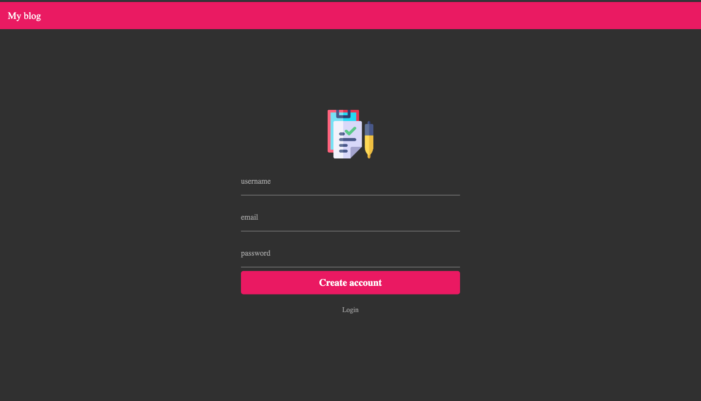
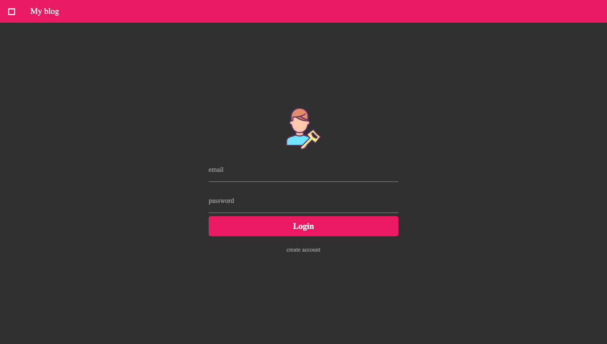
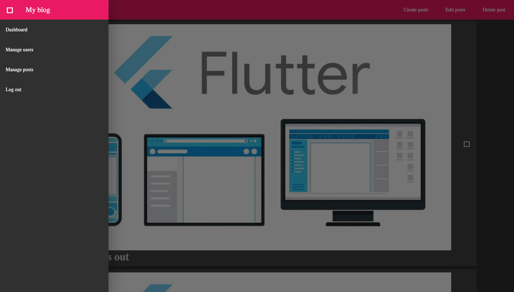

# Flutter web blog
This is a basic blog build with flutter web, mysql and php my admin, but I also developed some Apis for those of you who don't want to learn mysql or php. Please have in mind that both this project or flutter web are still under development.

## To configure flutter web on you machine visit
[flutter web](https://github.com/flutter/flutter_web)
[Or check my youtube channel](https://www.youtube.com/channel/UCRl79zOEtiLCglAFZJJzEZQ?view_as=subscriber)

## Registration screen

## login

## Home

